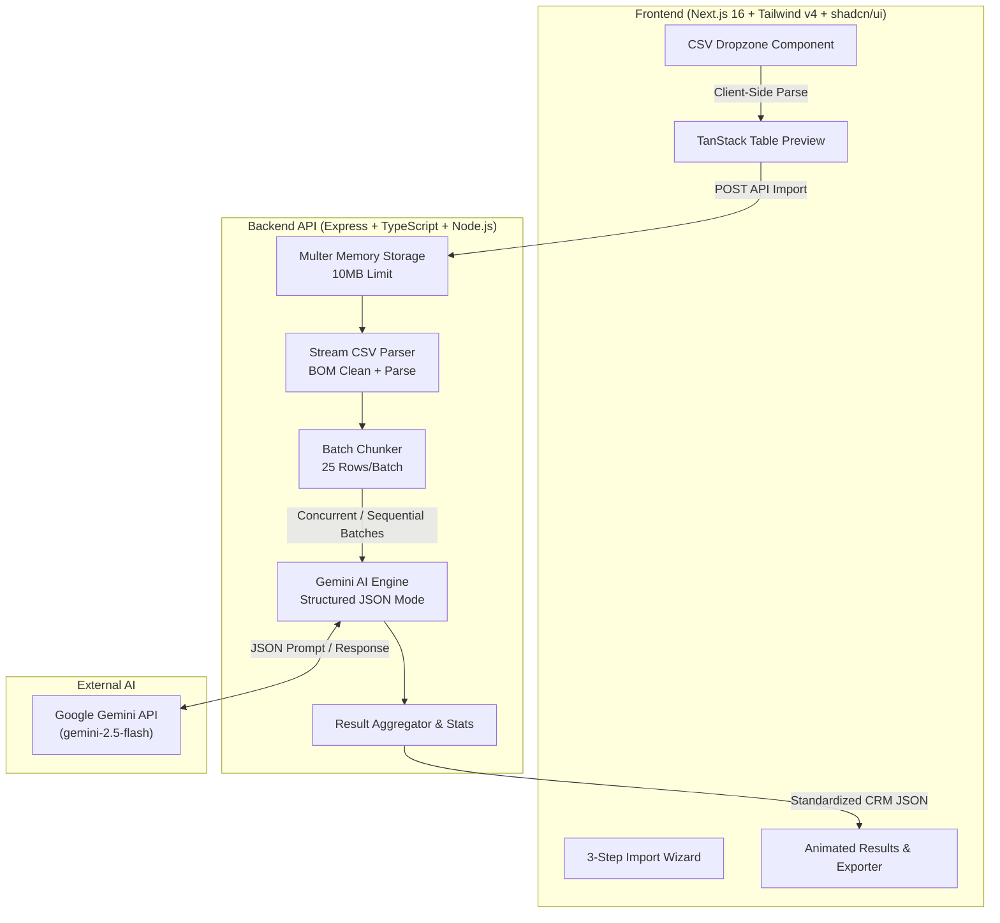

# AI-Powered CRM CSV Importer 🚀

An enterprise-grade, stateless intelligent CSV importing pipeline that allows users to upload **any** arbitrary CSV file and uses **Google Gemini AI** to semantically map unstructured data columns into a standardized **15-field CRM schema** with zero manual template mapping.

---

## ✨ Executive Summary & Features

### Core Capabilities
- **Intelligent Semantic Column Mapping**: Maps arbitrary CSV column headers (e.g., `First_Name`, `Lead_Status`, `Alt_Email`, `Source`) into standardized CRM attributes using deterministic structured JSON generation via `gemini-2.5-flash`.
- **Fault-Tolerant Batch Processing**: Automatically splits CSV rows into configurable chunks (`25` rows/batch) with independent retry loops and exponential backoff (`200ms → 400ms → 800ms`) plus jitter.
- **Strict Domain Validation (Zod)**: End-to-end type safety across frontend and backend. Enforces strict schema rules with graceful fallbacks and captures validation errors.
- **Contact Validation & Data Cleansing**:
  - Automatically skips rows missing both email and phone number per strict CRM hygiene rules.
  - Intelligently extracts country codes (`+91`, `+1`, etc.) and formats raw phone strings.
  - Combines split names (`First_Name` + `Last_Name` → `name`).
  - Preserves secondary emails and phone numbers inside `crm_note`.
  - Normalizes heterogeneous date formats into ISO 8601 UTC timestamps.
- **Modern 3-Step Wizard UI**:
  - **Step 1 (Upload)**: Drag-and-drop CSV upload powered by `react-dropzone` with instant client-side validation.
  - **Step 2 (Preview)**: Client-side CSV parsing (`PapaParse`) rendered via `TanStack Table` with sticky headers, pagination, and sorting.
  - **Step 3 (Results)**: Real-time animated dashboard displaying Count-Up KPI cards, status-badged Imported records, precise Skipped records with error reasons, and one-click JSON export.

---

## 🏛️ System Architecture



---

## 🛠️ Tech Stack

### Frontend (Deploy → Vercel)
- **Framework**: [Next.js 16](https://nextjs.org/) (App Router, React 19)
- **Language**: TypeScript (Strict Mode)
- **Styling**: Tailwind CSS v4 (`@theme` tokens, Dark-first Glassmorphism aesthetic)
- **UI Components**: Custom shadcn/ui compatible primitives (Radix UI)
- **Data Table**: [TanStack Table v8](https://tanstack.com/table/v8)
- **File Upload**: `react-dropzone`
- **CSV Parser**: `papaparse`

### Backend (Deploy → Render)
- **Runtime**: Node.js v20+
- **Framework**: Express 4 + TypeScript
- **AI Engine**: `@google/generative-ai` (`gemini-2.5-flash`)
- **Validation**: `zod`
- **File Processing**: `multer` (in-memory stream) + `csv-parser`
- **Logging**: Custom colored dev logger + JSON production logger

---

## 📋 Standardized 15-Field CRM Schema

Every imported record strictly conforms to the following schema:

| Field | Type | Description |
| :--- | :--- | :--- |
| `created_at` | string (ISO 8601) | Normalized date/time or empty string |
| `name` | string | Full lead name (combined First + Last if separated) |
| `email` | string | Primary email address |
| `country_code` | string | Numeric country code without `+` (e.g., `91`, `1`) |
| `mobile_without_country_code` | string | Digits-only mobile phone number |
| `company` | string | Company or organization name |
| `city` | string | City name |
| `state` | string | State / Province |
| `country` | string | Country name |
| `lead_owner` | string | Assigned rep or owner name |
| `crm_status` | enum | `GOOD_LEAD_FOLLOW_UP` \| `DID_NOT_CONNECT` \| `BAD_LEAD` \| `SALE_DONE` |
| `crm_note` | string | Remarks + preserved secondary contact details |
| `data_source` | enum | `leads_on_demand` \| `meridian_tower` \| `eden_park` \| `varah_swamy` \| `sarjapur_plots` |
| `possession_time` | string | Possession or move-in timeline |
| `description` | string | Additional context or raw notes |

---

## 🚀 Getting Started

### Prerequisites
- **Node.js**: `v20.x` or newer
- **Google Gemini API Key**: [Get a free API key at Google AI Studio](https://aistudio.google.com/apikey)

### Option A: Local Development (Recommended)

1. **Clone & Setup Environment**
   ```bash
   # Configure backend environment
   cd backend
   cp .env.example .env
   # Add your GEMINI_API_KEY inside backend/.env
   ```

2. **Start Backend Server**
   ```bash
   cd backend
   npm install
   npm run dev
   # Server listens on http://localhost:8000
   ```

3. **Start Frontend Dev Server**
   ```bash
   cd ../frontend
   npm install
   npm run dev
   # App listens on http://localhost:3000
   ```

### Option B: One-Command Docker Setup

Run the entire full-stack application using Docker Compose:

```bash
docker-compose up --build
```
- Frontend available at: `http://localhost:3000`
- Backend API available at: `http://localhost:8000`

---

## 📡 API Reference

### `POST /api/import`

Processes an uploaded CSV file through the Gemini AI mapping engine.

- **Content-Type**: `multipart/form-data`
- **Body Parameter**: `file` (CSV file, max 10MB)

#### Success Response (`200 OK`)
```json
{
  "success": true,
  "data": {
    "imported": [
      {
        "created_at": "2025-06-15T00:00:00Z",
        "name": "Rohit Mohammad",
        "email": "rohit@test.com",
        "country_code": "91",
        "mobile_without_country_code": "9579390123",
        "company": "TechCorp",
        "city": "Mumbai",
        "state": "Maharashtra",
        "country": "India",
        "lead_owner": "",
        "crm_status": "GOOD_LEAD_FOLLOW_UP",
        "crm_note": "Additional emails: rohit.m@gmail.com; Interested in 3BHK",
        "data_source": "meridian_tower",
        "possession_time": "",
        "description": ""
      }
    ],
    "skipped": [
      {
        "row_number": 3,
        "original_data": { "First_Name": "John", "Last_Name": "Doe" },
        "reason": "No email or phone number found"
      }
    ],
    "statistics": {
      "total_rows": 9,
      "imported_count": 7,
      "skipped_count": 2,
      "batch_count": 1,
      "processing_time_ms": 2651
    }
  }
}
```

---

## ☁️ Deployment Guide

### 1. Backend Deployment → Render
1. Create a new **Web Service** on [Render](https://render.com/).
2. Connect your Git repository and set the Root Directory to `backend`.
3. Configure settings:
   - **Build Command**: `npm install && npm run build`
   - **Start Command**: `npm start`
4. Add Environment Variables:
   - `NODE_ENV=production`
   - `PORT=8000`
   - `GEMINI_API_KEY=your_google_ai_studio_key`
   - `GEMINI_MODEL=gemini-2.5-flash`
   - `CORS_ORIGIN=https://your-frontend-app.vercel.app`

### 2. Frontend Deployment → Vercel
1. Create a new Project on [Vercel](https://vercel.com/) and select your Git repository.
2. Set the Root Directory to `frontend`.
3. Add Environment Variables:
   - `NEXT_PUBLIC_API_URL=https://your-backend-app.onrender.com`
4. Deploy! Vercel automatically builds and optimizes the Next.js App Router application.

---

## 🧪 Verification & Automated Testing

Included in the root folder is a comprehensive test file (`test-data.csv`) and an automated Vitest test suite.

```bash
# 1. Run Automated Unit & Domain Tests (Vitest)
cd backend && npm test

# 2. Verify Backend TypeScript Health
cd backend && npm run build

# 3. Verify Frontend Next.js Production Build
cd frontend && npx next build
```

---

## 📜 License
MIT License. Created as a production-grade Software Engineering Showcase.
